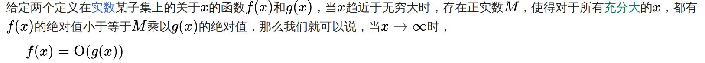

#

## 逻辑左移 SHL

指令格式：`SHL dest, src`

src代表移动的位数，dest代表要移动的寄存器

示例：

```assembly
mov AL, 0Ah        ; AL = 00001010 (十进制 10)
SHL AL, 1          ; AL = 00010100 (十进制 20)
```

简单地将二进制数左移一位，相当于十进制数乘以2，二进制数乘以10

## 逻辑右移 SHR

指令格式：`SHR dest, src`

示例：

```assembly
mov AL, 0Ah        ; AL = 00001010 (十进制 10)
SHR AL, 1          ; AL = 00000101 (十进制 5)
```

简单地将二进制数右移一位，相当于十进制数除以2，二进制数除以10

## 算术左移 SAL

指令格式：`SAL dest, src`

## 算术右移 SAR

指令格式：`SAR dest, src`

算术移动和逻辑移动的区别只在于右移，算术移动会根据符号位补充最左侧的空值，而逻辑移动会补充0

1. C
2. B
3. D
4. C
5. B
6. 定义：
   
   证明：
   当f(x) = n , g(x) = n+7, 且x -> ♾ 时
   f(x) / g(x) = n / (n+7) = 1 - 7 / (n+7) = 1
   即存在M=1，使得对于所有充分大的 x，都有f(x)的绝对值小于等于M乘以g(x)的绝对值
   所以f(x) = O(g(x))
   O(n) = O(n+7)

7. return语句应当改为`return n * fact(n);`
8. 代码实现如下
```C++
class Linked {
    struct Node {
        T data;
        Node* next;
    };
    Node* head;

    void reversePrintHelper(Node* node) {
        if (node == nullptr) {
            return;
        }
        reversePrintHelper(node->next);
        std::cout << node->data << std::endl;
    }

public:
    void reversePrint() {
        reversePrintHelper(head);
    }
};
```