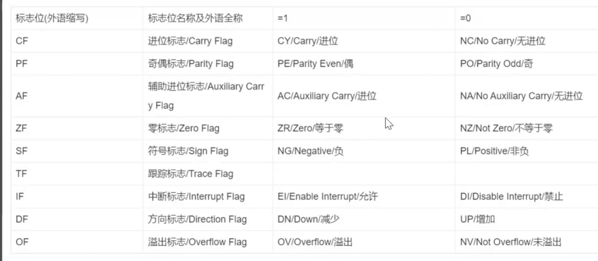

# 寄存器

## 指针寄存器

堆栈指针SP和基址指针BP

## 串操作寄存器

## 段寄存器

一段程序必须有代码段，若有数据，有变量，则需要数据段DS，若有栈操作，需要堆栈段SS

## 逻辑地址

一个完整的逻辑地址由基址和偏移地址组成

相当于使用A+B来进行表示一个地址，例如0100: 0003 则指的是第101个地址的第4个地址

## 控制寄存器

### 指令指针IP

IP与PC的作用类同，用于存放代码段中的偏移地址，不能随意进行更改

## 标识

### OF: Overflow flag

如果溢出了为1，否则为0

### SF: Sign flag

符号标志，将运算结果视为带符号数，如果结果为负数，则为1

### ZF: Zero flag

1为非0，0为0

### AF: Auxiliary carry flag

辅助进位标志，若借位或进位都为1

### CF: Carry flag

如果有进位

### PF: Parity flag

如果为偶数则为1，否则为0

### DF: Direction flag

?
方向标志，用于控制字符串操作的方向

### IF: Interrupt flag

中断标志，若为1则允许中断，否则不允许
