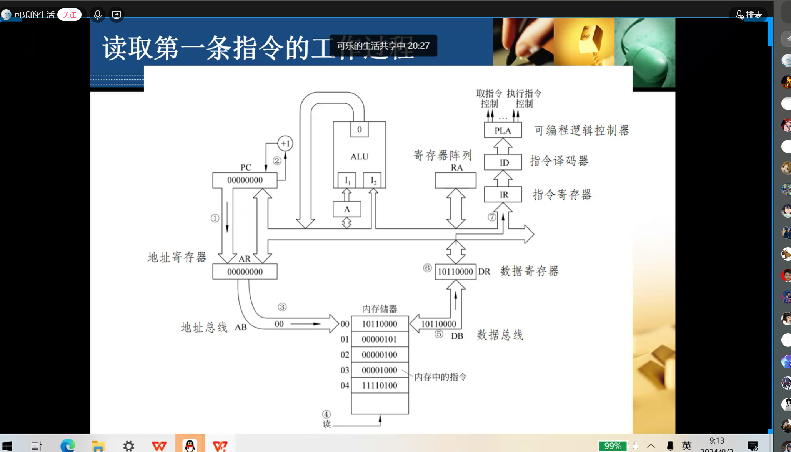
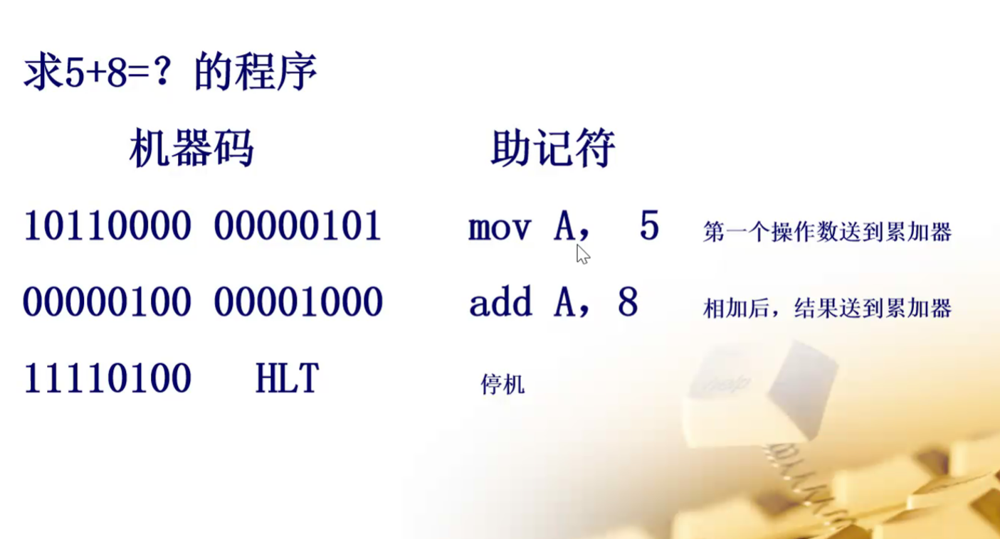
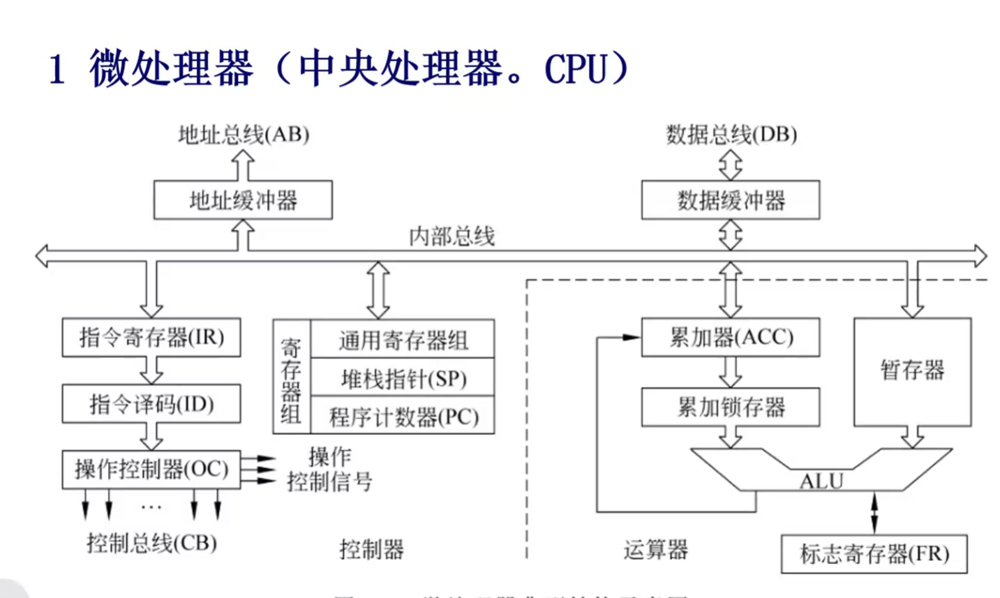

# 计算机组成原理 - 第一课

## 程序计数器

指向内存中的某个地址，该地址存放着下一条指令的地址,PC将地址发送到地址寄存器上

## 地址寄存器

存放内存地址的寄存器，通过地址总线将地址信息传送到内存储器中
寄存器是用于暂存数据的

## 内存储器

存放机器码

### RAM
被CPU随机进行读写的存储器，随机存储的优点是无论存储到哪儿，所用时间都是一样的
### ROM
只读存储器，只能读取不能写入，用于存放程序和数据

## CPU

控制器和运算器两部分组成

### 运算器

加法为基础，通过逻辑控制实现加减乘除与逻辑运算

### 控制器

发送控制信息

### 寄存器组

用于存放中间结果和最终结果，容量很小但速度很快
CPU可以直接存取寄存器组中的数据
例如执行1+1+2，1+1的结果存放在寄存器组中，然后再加2，最后将结果存放在寄存器组中

