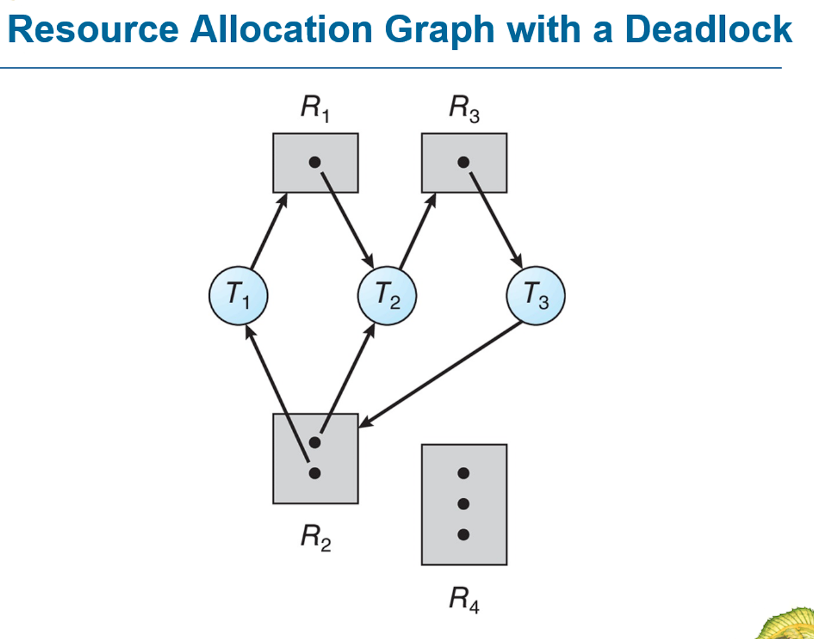

# 操作系统复习

## 难度星级用 `★` 表示，不熟悉的概念用`※`表示

### 第一章 · Hardware（硬件）

* Hardware ★

  * Architecture
  * CPU
  * Disk
  * Memory
  * IO
* Interrupt-driven ★★

系统中断，当某些事件发生时，将会让CPU先执行这些重要事件的操作，然后再恢复到原来的执行状态。

* Multi-programming & time-sharing ★★★

让多个程序同时运行在同一个CPU上，操作系统调度时可以让其他程序继续运行，提高了CPU利用率

---

### 第二章 · Operating System Fundamentals（操作系统基础）

* Dual mode ★★★

  * User mode
  * Kernel mode
* OS’s Services ★

| 类别                                      | 服务功能                | 示例                            |
| --------------------------------------- | ------------------- | ----------------------------- |
| 1. **程序执行（Program Execution）**          | 加载程序、运行程序、终止程序      | 加载 `.exe`，运行 Python 脚本        |
| 2. **I/O 操作（I/O Operations）**           | 统一处理所有输入输出设备的访问     | 读取文件、输出打印、网络收发                |
| 3. **文件系统管理（File-System Manipulation）** | 创建/删除文件、访问文件内容、权限控制 | `open()`, `read()`, `chmod()` |
| 4. **进程管理（Process Control）**            | 创建/终止进程、同步、通信       | `fork()`, `exec()`, 管道通信      |
| 5. **内存管理（Memory Management）**          | 分配/回收内存、虚拟内存、地址映射   | `malloc()`, 分页/分段管理           |
| 6. **安全与保护（Security and Protection）**   | 用户身份验证、访问控制、隔离机制    | 用户登录、ACL、权限位                  |
| 7. **错误检测（Error Detection）**            | 检测硬件/软件异常，保持系统稳定    | 内存访问违规、I/O 错误处理               |

打开文件资源管理器写入文档发生IO报错

打开文件资源管理器（程序执行 进程管理）写入文档（文件系统管理 内存管理 安全与保护）发生IO报错（I/O操作 错误检测）

* User and OS interface  ★★

  * Command
  * GUI
  * System call ★★
* Types of System calls ★★★

进程控制、文件管理、设备管理、信息维护和进程通信

* System programs ★

### 第三章 · Process Management（进程管理）

* Proccess states

1. New
2. Ready
3. Running
4. Waiting
5. Terminated

转化方式

1. New → Ready 正常进行
2. Ready → Running 调度器分配CPU
3. Running → Waiting 发生阻塞
4. Running → Ready 时间片用完
5. Waiting → Ready 阻塞解除
6. Running → Terminated 正常结束或异常终止

* Process concept

  * Process vs program ★★
  * Process in memory ★
  
  * Process states ★★★
  
  * PCB ★★★
  
* Scheduling

  * Queues ★
  
  * Scheduler ★
  
  * Context switch ★★★
  
* Process creation & termination

  * fork ★★
  * exec ★
  * wait ★
  * exit ★

* Process control block (PCB) ★★★
//todo
* Shared memory ★
* Message passing ★
* Socket ★★
* Pipe ★★

---

### 第四章 · Threads & Concurrency（线程与并发）

* Thread vs process ★★★
* Multi-core programming

  * Parallel vs concurrency ★★
  * Amdahl’s Law & speedup ★★
* Multithreading models

  * 1-1 ★★
  * m-1 ★★
  * m-m ★
  多线程模型，描述了用户线程和内核线程之间的关系。
* Pthread & Java thread ★
一个是实体机的线程实现，一个是虚拟机的线程实现。
* Thread pool ★
由软件进行维护，开发者直接在程序中使用多线程功能。

### 第五章 · CPU Scheduling（处理器调度）

* CPU/IO burst, CPU/IO bound ★
* Time for scheduling ★★
* Preemptive/non-preemptive ★★
* Scheduling criteria ★★★ （调度目标）
| 调度标准        | 英文              | 解释                      | 举例                                |
| ----------- | --------------- | ----------------------- | --------------------------------- |
| **CPU 利用率** | CPU Utilization | 让 CPU 尽可能不空闲            | ≥ 40%（低负载系统），≥ 90%（高负载）           |
| **吞吐量**     | Throughput      | 每单位时间完成的进程数量            | 单位：processes per second           |
| **周转时间**    | Turnaround Time | 从提交到完成的总时间              | turnaround = completion - arrival |
| **等待时间**    | Waiting Time    | 进程等待 CPU 的总时长（不含执行时间）   | = turnaround - burst time         |
| **响应时间**    | Response Time   | 从提交到首次响应的时间（特别重要于交互式系统） | 如键入命令后首次输出所需时间                    |
| **公平性**     | Fairness        | 每个进程能公平获得 CPU 机会        | 防止饥饿（Starvation）问题                |

* Scheduling algorithms

  * FCFS ★★★
  * SJF ★★★
  * Round-robin ★★★
  * Priority ★★★
  * Shortest remaining time first ★
  * Multilevel Queue Scheduling ★

* Average wait time / / Gantt chart
* Thread scheduling ★

  * Contention scope ※
  每个线程都有自己的竞争域。
  User-level（一般由用户的某个线程库管理）一个线程阻塞所有的都会阻塞，但是优点是上下文切换快。
  Kernel-level（由操作系统内核管理）一个线程阻塞不会影响其他线程，效率较高，但是上下文切换慢。
* Multi-processor scheduling

  * Processor affinity ★★
  * NUMA ★
  * Load balancing ★★
* Real-time scheduling

  * Hard/soft real time ★
  * Deadline, period, rate ★
  * RM scheduling algorithm ★★
  * EDF scheduling algorithm ★★

---

### 第六章 · Synchronization（进程同步）

* Race condition ★★
* Critical section problems ★★

  * Three requirements
* Peterson’s solution ★
* Atomic instruction ★★

  * test_and_set
  * compare_and_swap
* Mutex lock ★★★

  * spinlock
* Semaphore ★★★

  * Counting
  * Binary
  * wait
  * signal
  * Atomic
* Deadlock & starvation ★
* Priority inversion ★
* Classic synchronization problems ★★★

  * Producer-consumer
  * Reader-writer
  * Dining philosopher
* Monitor

  * Structure and properties ★★
  * Use of monitor ★

---

### 第七章 · Deadlocks（死锁）

* Necessary conditions ★★

四个基本条件 **REMEMBER**

1. 互斥条件（Mutual Exclusion）
2. 请求与保持条件（Hold and Wait）
3. 不剥夺条件（No Preemption）
4. 循环等待条件（Circular Wait）

* Resource allocation graph ★★

  * Cycle and deadlock
* Deadlock prevention ★★
* Deadlock avoidance ★

  * Safe/unsafe/deadlock
  * Banker’s algorithm
* Deadlock detection ★

---

### 第八章 · Memory Management（内存管理）

* Virtual address space ★★
* Virtual vs Physical address ★
* Memory management hardware ★

  * MMU
  * Base/limit register
* Static/dynamic linking ★
* Memory mapped files & shared memory & memory-mapped I/O ★★
* Dynamic memory allocation ★★

  * Best/worst/first fit
  * Internal/external fragmentation
* Segmentation ★★
* Paging ★★★

  * Frame, page, page number, frame number
  * Page offset, page size
  * Page table, frame table
  * TLB: hit, miss, ratio
  * Effective memory access time
  * Valid bit, r/w bit
* Hierarchical page table ★★
* Inverted page table ★★

---

### 第九章 · Virtual Memory（虚拟内存）

* Swapping ★★
* Demand paging ★★★

  * Page fault, page fault rate, access time
* Copy-on-write ★
* Page replacement

  * Victim page, dirty/modify bit ★
  * Replacement scope ★
  * Reference string ★★
  * FIFO ★★★
  * OPT ★★★
  * LRU ★★★
  * Clock algorithm ★★
  * Reference bit
  * Page buffering ★
* Thrashing ★★

  * Locality, working set window, size
* Buddy system ★★
* Slab allocator ★
* Pre-paging ★
* Page size choice ★

---

### 十章 · File System Basics（文件系统基础）

* File concept ★★
* Access methods ★★
* Directory and Disk structure ★★★
* File-system mounting ★
* File sharing ★
* Protection ★★

---

### 十一章 · File System Implementation（文件系统实现）

* File-system structure ★★★
* File-system implementation ★★★
* Directory implementation ★★
* Allocation methods ★★
* Free-space management ★★★

---

### 十二章 · Mass Storage Management（大容量存储管理）

* Disk structure ★★★
* Disk Attachment ★★
* Disk scheduling ★★★
* Disk management ★★★
* RAID structure ★

---

### 十三章 · I/O System（输入输出系统）

* I/O Hardware
* Application I/O interface
* Kernel I/O subsystem
* Transforming I/O requests to hardware system
* DMA, Spooling, Buffering

---
