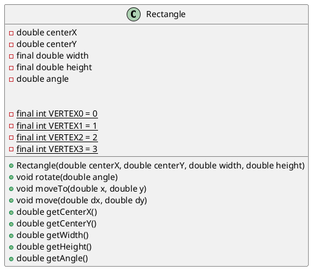

# 1 验证性内容学习情况自查

完成实验1的第2部分内容的学习。

1. 是否完成2.1部分内容，理解类的声明和定义的基本语法，能独立绘制简单类图？
是
2. 是否完成2.2部分内容，理解构造器和初始化器的基本用法，掌握对象的创建与成员访问的基本语法？
是
3. 是否完成2.3部分内容，理解类成员的基本概念以及用法？
是
4. 是否完成2.4部分内容，理解静态环境的概念及用法？
是
5. 是否完成2.5部分内容，熟悉访问控制符的用法？
是
6. 是否存在其他学习问题？
否

## 附上Circle代码
```JAVA
package experiment1;

public class Circle {
    private static int circleCount = 0;

    public static int getCircleCount() {
        return circleCount;
    }

    // 此为静态代码块，当类被加载时会执行
    // 无论创建多少个对象，静态代码块只会执行一次
    static {
        System.out.println("Circle class loaded! This class is used to represent a circle.");
    }
    // 默认构造函数

    /**
     * Circle类的构造函数
     * 该构造函数没有参数的时候将会将半径初始化为1.0
     */
    public Circle() {
        circleCount++;
        this.radius = 1.0;
        System.out.println("Warning: Radius is not given! Circle created with default radius: " + this.radius);
    }

    /**
     * Circle类的构造函数
     * 该构造函数没有参数的时候将会将半径初始化为1.0
     *
     * @param radius 半径
     */
    public Circle(double radius) {
        circleCount++;
        this.radius = radius;
    }

    // 半径
    private double radius;

    // 面积计算
    public double getArea() {
        return Math.PI * radius * radius;
    }

    // 周长计算
    public double getPerimeter() {
        return 2 * Math.PI * radius;
    }

    // 获取半径
    public double getRadius() {
        return radius;
    }

    // 初始化半径
    public void setRadius(double radius) {
        this.radius = radius;
    }
}
```

# 2 矩形类图


