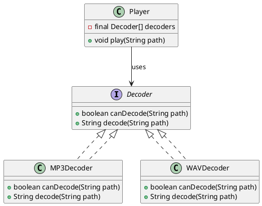
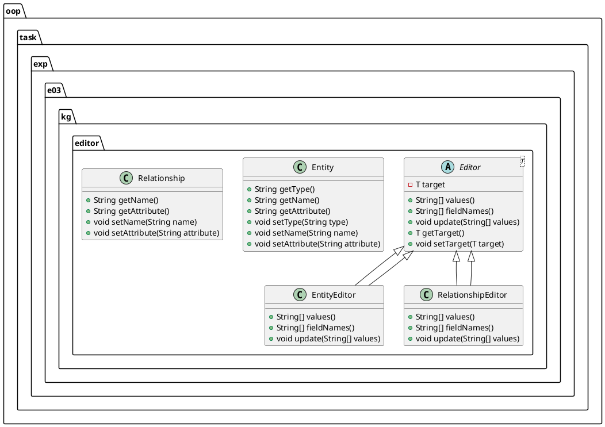

# 1 验证性内容学习情况自查

完成实验1的第3部分内容的学习。

1. 是否完成3.1部分内容，理解抽象类的基本概念和用法？
   是
2. 是否完成3.2部分内容，理解抽象函数的概念与用法？
   是
3. 是否完成3.3部分内容，理解接口的概念和用法？
   是
4. 是否完成3.4部分内容，理解多态的概念和用法？
   是
5. 是否存在其他问题？
   否

# 2 类图

1. 实验3.1的类图



2. 实验3.2的类图



# 3 关于选择多行文本作为实体的时候修改导致换行符丢失的解决方案

## 问题描述

框选多行文本后，点击空格转换为实体时发现实体按照原文本的格式渲染，但是在更改实体时无论是否改变原内容，都会导致文字的换行符丢失，实体文字渲染为一行。

## 问题分析

推测是更改实体中文字时换行符丢失，查阅EditorDialog代码并在不同位置打印文字内容发现，实体文字在EditorDialog的构造函数中已经丢失了换行符。

```java
pubclic EntityDialog(String title, String[] values) {
//    ......
    for (int i = 0; i < values.length; i++) {
            System.out.println("First: " + values[i]);
            // 此时还未被删除
            textFields[i] = new TextFields(values[i]);
            // 判断为这里的构造函数删除了换行符
            System.out.println("Second: " + textFields[i].getText());
            // 此时换行符被删除
        }
}
//    ......
```

输出如下：

```shell
First: 1 2 3
4 5 6
Second: 1 2 3 4 5 6
```

可以看出两次打印的区别，第二次打印丢失了换行符。

## 修复方案

### 方案一：创建实体时就删除换行符

在创建实体时删除换行符，规定实体的文本内容不包含换行符。

addEntity方法接收一个String类型的text参数，调用此方法前删除text中的换行符即可

```java
public void add(String text) {
    // 删除text中的换行符
    text = text.replace("\n", "");
    graph.addEntity("", text, "").ifPresent(e -> {
      getChildren().add(new EntityLabel(e));
    });
  }
```

### 方案二：保留多行文本的特性

源代码采用TextField创建单行输入框，通过查询文档得知可以使用TextArea来创建多行输入框，修改EntityDialog中的TextField为TextArea即可。

```java
pubclic EntityDialog(String title, String[] values) {
//    ......
    for (int i = 0; i < values.length; i++) {
        textAreaArray[i] = new TextArea(values[i]);
    }
//    ......
}
```