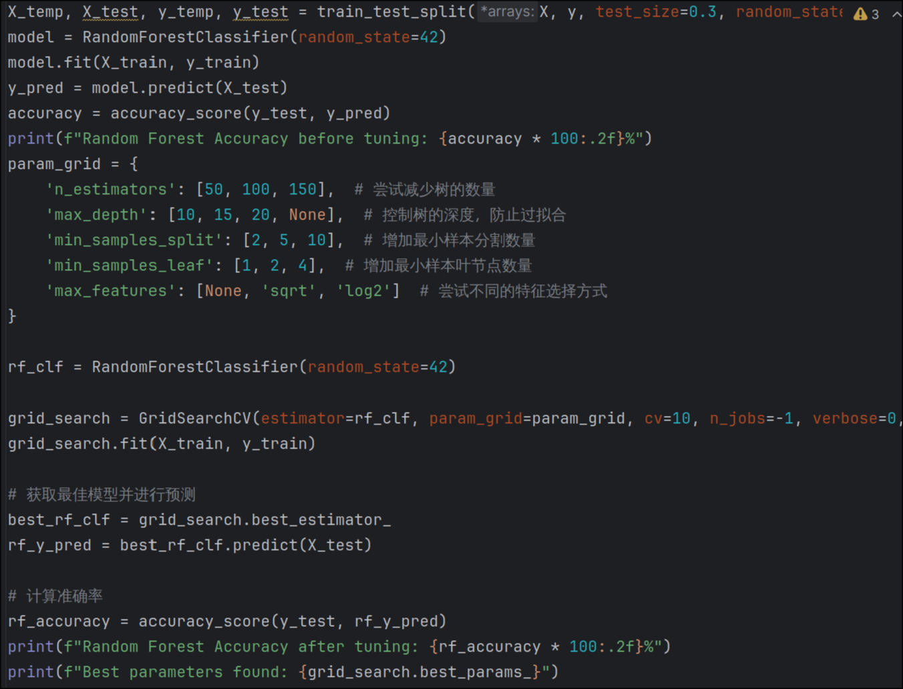
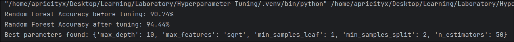

# 2.23-2.28周报
汇报人：唐浩玮
## 本周完成工作

学习智能决策模型课程，了解基础概念

尝试使用sklearn库中的数据集进行模型训练，实践划分训练集和测试集，使用交叉验证策略进行模型调参，较大提升正确率

## 下周学习规划

- 尝试寻找综述型论文进行阅读
- 阅读学习论文：MKG-FENN: A Multimodal Knowledge Graph Fused End-to-End Neural Network for Accurate Drug–Drug Interaction Prediction