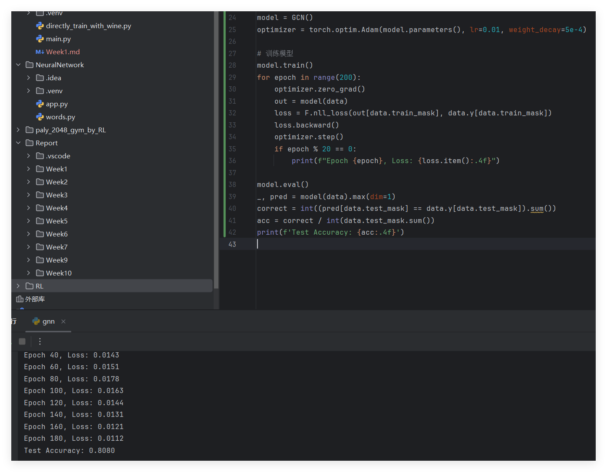

# 第十周周报

汇报人：唐浩玮

## 本周完成工作

- 学习图神经网络
- 阅读 A Gentle Introduction to Graph Neural Networks https://distill.pub/2021/gnn-intro/
- 完成GCN在Cora上的节点分类实践

## 下周学习规划

- 结合capsule项目进一步了解图神经网络的应用，完成图神经网络的学习

## 学习进度

- [X] 数据集划分

  - [X] 交叉验证
  - [X] 过拟合防范
  - [X] 评估指标（如 AUC、RMSE、Rp）
- [X] 深度学习基础

  - [X] 前向传播
  - [X] 反向传播
  - [X] 损失函数（如交叉熵、均方误差）
  - [X] 梯度下降法
- [ ] 图神经网络

  - [x] GNN
    - [x] GCN
  - [ ] GAN
  - [ ] 在图数据（如分子图）上提取特征
- [ ] 卷积神经网络（CNN）

  - [ ] 卷积层：卷积操作、滤波器、步幅、填充
  - [ ] 池化层：最大池化、平均池化
  - [ ] 激活函数：ReLU、Sigmoid 等
  - [ ] 全连接层：特征映射到输出
  - [ ] CNN 架构：LeNet、AlexNet、VGG、ResNet
