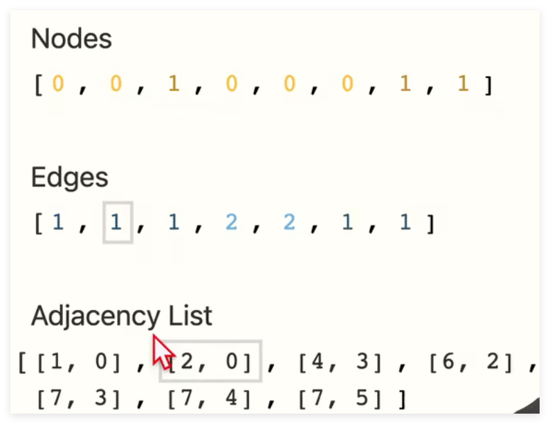
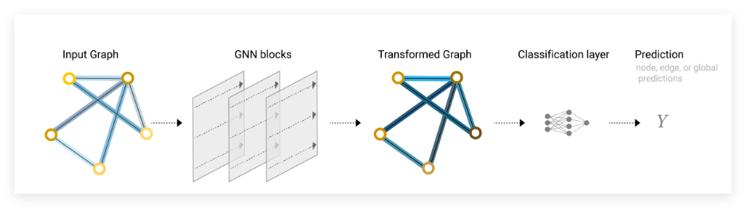

# 图神经网络

## GNN

 将神经网络和图进行结合

但是将输入变为了一个邻接矩阵

邻接矩阵输入会面临空间复杂度高和节点顺序不同矩阵不同的问题

由此引入一种新的表达方式：

节点和边的标量矩阵代表各自的属性，Adjacency List反映了节点和边的关系，例如[1,0]就是指第一个节点和第0个节点有一条边，[1,0]的下标是0，故对应的是edges列表中的第0个边，这样操作存储高效且顺序无关，节点和边的顺序调换邻接列表的顺序也会改变

GNN引入了一种新的计算框架，输入是图，输出也是图

## MLP 多层感知机

GNN网络中，一层是由多层感知机组成的，会由三个不同的映射规则${f_{U_n}}$、${f_{V_n}}$、${f_{E_n}}$分别处理节点、边和邻接矩阵

## 池化层

池化层（Pooling Layer） 是用于汇总整个图或子图的表示的一种操作，类似于卷积神经网络中的池化层，它的目标是降低图的尺寸、提取高层次特征或得到整个图的固定维度表示。

## 最简单的GNN流程

输入层，输入一个标量化的邻接矩阵→GNN全连接层（多层感知机）→变化过后的图→分类层→池化层（如果需要）→输出
