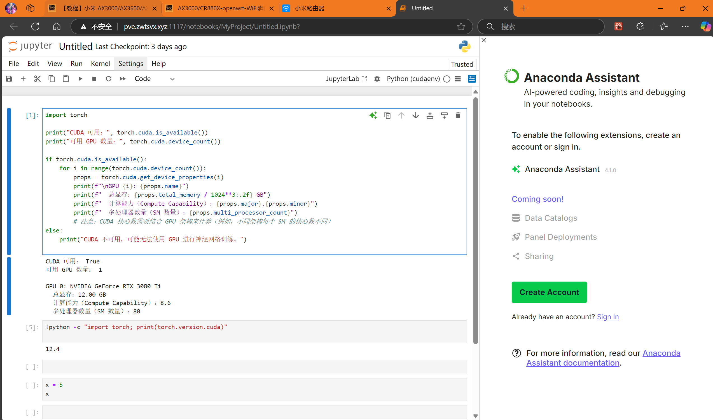

# 第二周周报

汇报人：唐浩玮

## 本周完成工作

学习Reinforcement Learning基础概念，学习马尔科夫决策过程，了解奖励函数、状态值函数与动作值函数

在服务器上搭建Jupyter Notebook

进行论文阅读 Li, Y.Deep Reinforcement Learning: An Overview.arXiv:1812.05551, 2017.

## 下周学习规划

- 尝试应用马尔科夫决策过程
- 阅读学习论文：MKG-FENN: A Multimodal Knowledge Graph Fused End-to-End Neural Network for Accurate Drug–Drug Interaction Prediction
