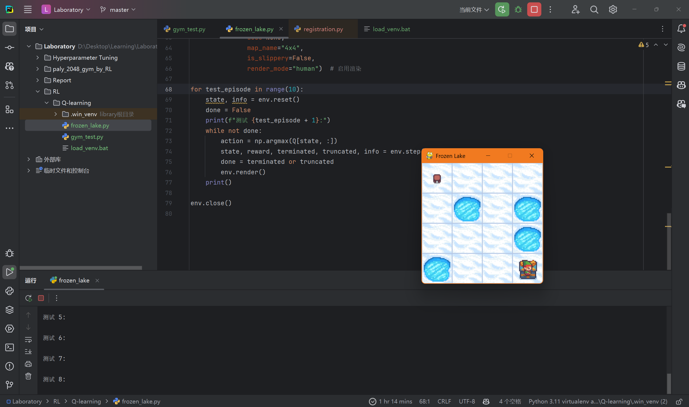

# 第三周周报

汇报人：唐浩玮

## 本周完成工作

- 学习Q-Learning，尝试使用Q-Learning结合openai的gymnasium库训练智能体通关FrozenLake游戏

- 继续进行论文阅读 Li, Y.Deep Reinforcement Learning: An Overview.arXiv:1812.05551, 2017.

## 下周学习规划

- 阅读学习论文：MKG-FENN: A Multimodal Knowledge Graph Fused End-to-End Neural Network for Accurate Drug–Drug Interaction Prediction
- 学习神经网络
