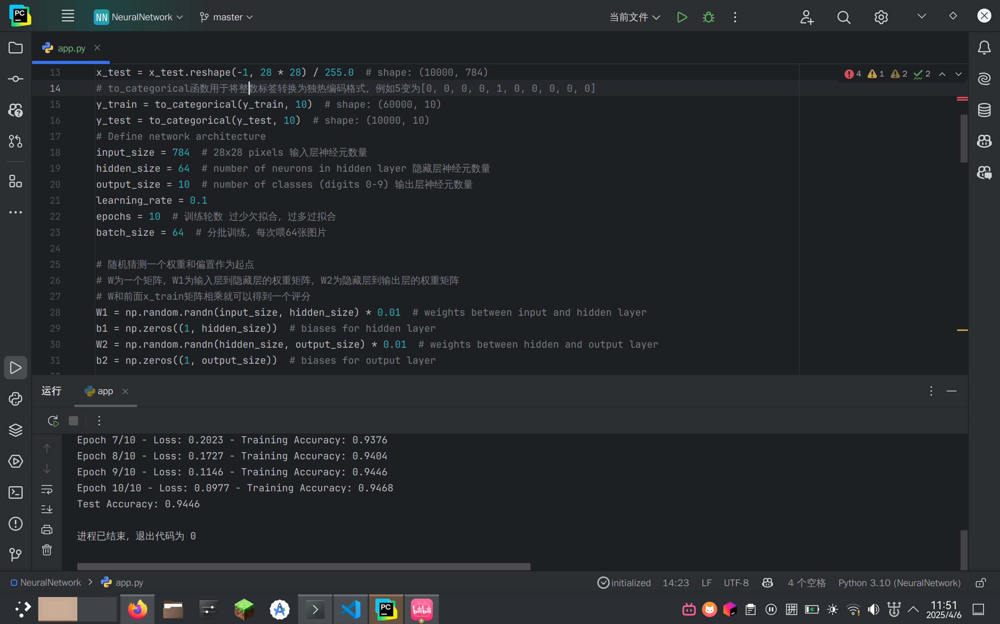

# 第六周周报

汇报人：唐浩玮

## 本周完成工作

- 继续阅读论文Learning motif-based graphs for drug–drug interaction prediction via local–global self-attention
- 继续学习神经网络基础知识
- 阅读并理解基于神经网络与MNIST数据集进行数字识别的代码

## 下周学习规划

- 继续阅读论文
- 阅读capsule代码
- 继续深入学习神经网络，学习图神经网络

## 学习进度

- [X] 数据集划分

  - [X] 交叉验证
  - [X] 过拟合防范
  - [X] 评估指标（如 AUC、RMSE、Rp）
- [X] 深度学习基础

  - [X] 前向传播
  - [X] 反向传播
  - [X] 损失函数（如交叉熵、均方误差）
- [ ] 图神经网络

  - [ ] 在图数据（如分子图）上提取特征，如 GCN
  - [ ] 注意力机制

## 本周学习资料

【【官方双语】深度学习之反向传播算法 上/下 Part 3 ver 0.9 beta】https://www.bilibili.com/video/BV16x411V7Qg?vd_source=16c2ffe0b7fab030621343a4cb0d291e

